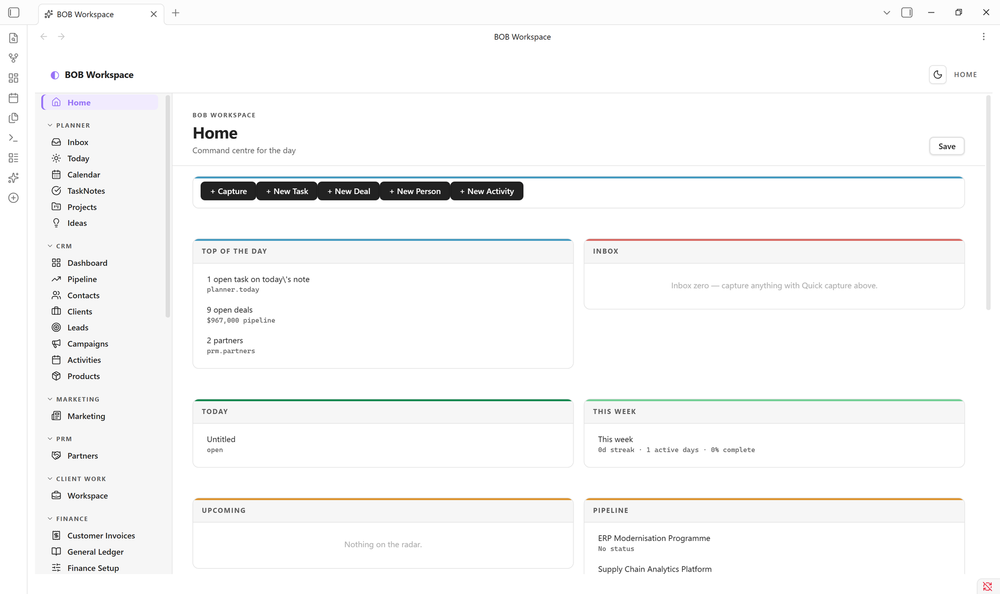

# BOB Workspace — a workspace for working life

A unified Obsidian plugin for **CRM, PRM, project management, daily planning, and reminders** — all on top of plain markdown. No server, no sync service, no lock-in. Your vault stays your vault.

This repository is a BOB Workspace customization of the original Cadence plugin. The plugin is intended to stay vault-model aware: built-in fields are only fallbacks, while real vault behavior should come from schemas, Bases, and `workspace.json` overrides. When schema support is enabled and the source folder is empty, the plugin can bootstrap canonical schema YAML from the current workspace entity definitions and then regenerate the derived FileClasses and JSON Schema outputs.

For extension guidance, see [Extending BOB Workspace Without Code Changes](docs/extending-bob-workspace.md).

💬 **Docs, support, and community:** join the **ThirdBrain BOB** Skool community → https://www.skool.com/thirdbrain-tech-3102



---

## Why BOB Workspace

Most "second brain" plugins do *one* thing well. BOB Workspace is the opposite: a coherent **workspace** that brings together the surfaces a working person actually moves between every day — today's tasks, the week ahead, deals in flight, contacts, projects, recurring reminders — and presents them in a single tab with one familiar nav.

- **Markdown is the source of truth.** Every contact, deal, project, activity is a `.md` file with frontmatter. Tasks, Dataview, Templater all keep working. Move to a different vault tomorrow — your data goes with you.
- **One tab, many surfaces.** A left rail lets you flip between Home → Today → Pipeline → Contacts → Projects → Inbox → Reports without ever leaving the workspace tab.
- **Module toggles.** Turn off CRM, PRM or Planner if you only want some of it.
- **Reminders that fire.** A small Inbox + capture modal + ticker = real notifications, not just a tag on a note.

---

## Features

### Home — your command centre
Two-column dashboard: today's tasks (tickable inline) · this week's progress · upcoming deadlines · partners due for follow-up · top active projects with milestone progress · pipeline at a glance · recent activity. Optional "open on Obsidian startup" + Homepage plugin compatible.


### Planner
- **Today** — diary view of today's daily note with quick-add task and autosaving journal
- **Calendar (week)** — Mon–Sun grid across daily notes; tick any task from any day
- **Projects** — status-grouped card grid with milestone progress and next-up dates
- **Inbox** — universal capture + reminders; items grouped by Now / Today / This Week / Later


### CRM
- **Dashboard** — pipeline-by-stage bars, hot deals (top by value), stale deals (no edits in 14+ days), recent activity, customer base mini-stats
- **Pipeline** — kanban board across deal stages; drag-and-drop a card to update its `stage` frontmatter; Won column gets a soft emerald tint
- **Contacts / Companies / Activities** — sortable list views with rich frontmatter editing


### PRM
Partners · Registrations · Commissions · Leads · Certifications · Analytics — same entity-list pattern, in their own folders, with status enums and Reports that aggregate across them.

### Project Management
Click a project, get a **real PM surface** — not a markdown editor. Hero with status/priority pills, owner, due date, color-banded progress bar. Left column: tickable milestones (date + title + delete on hover) and tasks with `+ Add` buttons. Right column: Brief, Scope, Risks, Stakeholders, Notes — all autosaving textareas writing back to their H2 sections. `Open as note` for full body editing in Obsidian's editor.


### Reminders
Quick-capture with `Cmd+Shift+I` → modal with text, optional datetime, optional repeat (daily/weekly). The plugin ticks every 30 seconds and fires due reminders as in-app notices (and optionally desktop notifications). Snooze 15m / 1h / tomorrow on any reminder. The nav badge shows live overdue count.


### Reports
Pipeline · Sales · Partners · Activity · Productivity. These surfaces are config-driven dashboards with widget catalogs rather than separate hardcoded report screens. Productivity follows the configured task mode: daily note checkboxes, TaskNotes, or hybrid. TaskNotes history includes the active TaskNotes folder plus the configured archive folder.

### New entity capture
A clean two-column modal for every entity type — type-aware widgets (date pickers, dropdowns for stage/status/priority/tier/type), smart defaults, smart placeholders, primary field marked required. Enter to submit, Esc to cancel.


### CSV import
Bring an entire client list, pipeline, or partner roster in from a spreadsheet. Run **BOB Workspace: Import from CSV** (or hit "Import CSV" on any list view) → pick a `.csv` from your vault or paste raw text → BOB Workspace auto-maps columns to entity fields by name (with synonyms — `Email`, `email`, `Email Address` all map to `email`). Override any mapping, see a sample of the first two rows, then import. Each row becomes one markdown file with frontmatter populated.


### XLSX workbook export / import
Export your entities to a multi-sheet `.xlsx` workbook (one sheet per entity type, grouped by area) with **BOB Workspace: Export to XLSX**, and round-trip edits back in with **Import XLSX**. The SheetJS library is bundled into the plugin, so export/import works offline with no extra files to install.

### Bases-backed views
Entity lists can be driven by Obsidian **Bases** (`.base`) files for richer filtering, sorting, and column control. A single **Bases folder** setting controls where every `.base` lives, and **Generate missing bases** creates a starter `.base` (filter + table view) for any entity that doesn't have one — including entities you define purely via schema YAML. See *Configuration* below.

---

## Install

### Community plugin store *(once approved)*
1. Settings → Community plugins → Browse
2. Search "BOB Workspace"
3. Install → Enable

### Manual install (works today)
1. Download `main.js`, `manifest.json`, and `styles.css` from the [latest release](https://github.com/cbruyndoncx/obsidian-bob-workspace/releases/latest) (workspace templates and the XLSX library are bundled inside `main.js`)
2. Drop them into `<your-vault>/.obsidian/plugins/bob-workspace/`
3. Settings → Community plugins → Reload → Enable **BOB Workspace**

### First run in a new vault
When you install the plugin into a fresh vault, BOB Workspace opens with a setup picker if no `workspace.json` exists yet. Choose a starter template, or skip for now and build the workspace yourself.

After you apply a template, the plugin writes the active `workspace.json` into the plugin folder and reloads the workspace. If schema support is enabled and the schema source folder is empty, it also bootstraps canonical schema YAML from the current workspace entity definitions and generates the derived FileClasses and JSON Schema outputs.

The plugin then creates note folders on demand as you use the surfaces. It does not require you to pre-create the full folder tree before testing.

### Starter templates
The shipped templates are:

- **BOB Workspace** - the full vault model: Planner, CRM, PRM, Client Work, Finance, Suppliers & Procurement, Reports, AI Workspace.
- **EMAI Starter** - a PARA-style personal workspace: **Human** (tasks, projects, areas, resources, people, daily, reviews), **Content** (videos, briefs, calendar, research), and **Machine** (workflows, SOPs, agents, code, skills).
- **CRM Only** - a narrower workspace focused on CRM, Planner basics, and Reports.
- **Cadence Classic** - the original Cadence-style layout with the legacy folder model.
- **Minimal** - a blank starting point with only Home and Settings.

Use **BOB Workspace** for the full business model, **EMAI Starter** for a PARA personal-productivity workspace, **CRM Only** for a lighter start, or **Minimal** to build everything by hand.

**Templates bring their own entities.** A template can embed its entity definitions (schema YAML) and `.base` files. Applying it writes *exactly* those into the configured schema/Bases folders, so a template like EMAI Starter provisions only its own entities on a fresh vault — it never falls back to the full built-in business model. (Built-in templates whose entities are built-in, like BOB Workspace, bootstrap from the built-in definitions as before.)

**Switching templates is clean.** Applying a *different* template first archives the outgoing template's full schema state — source YAML, the derived `fileClasses/` and `json-schema/` outputs, `.base` files, and a labelled copy of `workspace.json` — into sibling `…-archive-<template>-<timestamp>` folders, reversible (moved, never deleted). So you can try several templates in one vault without files compounding. Re-applying the *same* template is idempotent (only fills in what's missing).

---

## Quick start

1. **Open the app** — Click the ✨ sparkles icon in the left ribbon, or run **Open BOB Workspace** from the command palette
2. **Capture a deal** — CRM → Pipeline → `+ New Deal` → fill in title, stage, value → Create
3. **Capture a contact** — CRM → Contacts → `+ New Contact`
4. **Plan a project** — Planner → Projects → `+ New Project` → click into it → tick milestones, fill in Brief
5. **Set a reminder** — `Cmd+Shift+I` → "Call John" → Remind me → +1h → Capture. Wait. The notification fires.
6. **Make BOB Workspace your homepage** — Settings → BOB Workspace → toggle "Open BOB Workspace on Obsidian startup"
7. **Seed schemas if needed** — when schema support is enabled, the plugin can generate missing canonical schema YAML in the configured source folder and then write the derived FileClasses and JSON Schema outputs.

BOB Workspace creates folders on demand. The shipped defaults follow a numbered vault layout — contacts in `10-ME/10-PEOPLE/`, clients and deals in `30-CLIENTS/`, partners in `20-COMPANY/35-PARTNERS/`, etc. Move them anywhere afterwards — change paths in Settings if you do.

---

## Configuration

Settings → BOB Workspace:

The surface areas are easiest to understand in this order:

1. **Workspace** - the source-of-truth `workspace.json` for schemas, Bases, navigation, dashboards, templates, and workbook groups.
2. **Data model** - canonical schema YAML, plus bootstrap/regenerate actions when the schema folder is empty. Also home to the **Bases folder** setting (authoritative location for every `.base`) and the **Generate missing bases** action (creates a starter `.base` for any entity — built-in or schema-defined — that lacks one).
3. **Bases** - view configuration for each entity, either through `workspace.json.bases` or the Base selectors in Settings. Changing the Bases folder relocates where every base is resolved; the filename comes from the entity config, the folder from the setting.
4. **Navigation** - the left rail, secondary tabs, and module groups.
5. **Dashboards** - Home, CRM, Reports, and any custom surfaces composed from widgets.
6. **Widgets** - the widget catalog and inventory used by dashboards and reports.
7. **Modules** - Planner / CRM / PRM / Client Work / Finance / Procurement toggles.
8. **App** - startup behavior, tab choice, week start, daily-note folder, task/journal headings, and similar portable defaults.
9. **Reminders** - reminder notifications and cleanup.
10. **Currency** - money formatting across the workspace.

When you are customizing a vault, use this order:

1. Pick a starter template or apply your own `workspace.json`.
2. Define or bootstrap the schema layer.
3. Associate `.base` files for entities that need view behavior.
4. Adjust navigation groups and secondary tabs.
5. Tune dashboards and report widgets.
6. Set modules, folders, and app defaults.
7. Test the resulting workspace in the vault before copying it elsewhere.

---

## Hotkeys

| Action | Shortcut |
| --- | --- |
| Open BOB Workspace | (assignable, no default) |
| Quick capture (with optional reminder) | `Cmd+Shift+I` (`Ctrl+Shift+I` on Windows/Linux) |
| Open BOB Workspace — Home | (assignable) |
| Open BOB Workspace — Today | (assignable) |
| Open BOB Workspace — Calendar | (assignable) |
| Open BOB Workspace — Pipeline | (assignable) |
| Open BOB Workspace — Inbox | (assignable) |
| Import from CSV | (assignable) |
| New today entry (creates if missing) | (assignable) |

Bind your favourites under Settings → Hotkeys → search "BOB Workspace".

---

## How the data is stored

```
your-vault/
  daily/                          ← daily notes (your existing setup)
    2026-05-05.md
  10-ME/10-PEOPLE/Jane Smith.md
  20-COMPANY/00-PROFILE/Acme.md
  20-COMPANY/35-PARTNERS/Distribution Co.md
  30-CLIENTS/Acme — FTTH expansion.md
  30-CLIENTS/Discovery call with Jane.md
  30-CLIENTS/Q3 launch.md
  ...
```

Each entity is plain markdown with YAML frontmatter — readable, editable, scriptable, portable. BOB Workspace's views are just rich lenses over these files; everything you do in the UI writes back to them.

With schema support enabled, the plugin also writes canonical schema YAML to the configured schema source folder and derives `fileClasses/` plus `json-schema/` outputs from that source.

---

## Companion theme

A matching **Cadence** theme is available separately for vaults that want a fully-tuned visual system (warm paper surfaces, emerald accents, Geist + JetBrains Mono typography). The plugin works with any Obsidian theme; the theme is purely cosmetic.

---

## Roadmap

- Drag-to-reorder milestones in Project Detail
- Linked entities (project ↔ deal ↔ contact pickers with fuzzy search)
- Time-blocked Calendar (drag tasks onto today's hour grid)
- Pomodoro / focus timer linked to a reminder
- Optional sync to a future BOB Workspace web instance (the API setting is the placeholder for this)

---

## Development

```bash
git clone https://github.com/cbruyndoncx/obsidian-bob-workspace
cd obsidian-bob-workspace
npm install
npm run build   # bundles src/ TypeScript (+ templates and the XLSX library) into main.js
# Drop main.js + manifest.json + styles.css
# into <vault>/.obsidian/plugins/bob-workspace/ to test.
```

PRs welcome. For bug reports, please include your Obsidian version, OS, and a minimal vault to reproduce.

---

## Community & support

For documentation, questions, and support, join the **ThirdBrain BOB** community on Skool:

👉 **https://www.skool.com/thirdbrain-tech-3102**

That's the best place for setup help, template/workspace guidance, and to share how you use BOB Workspace.

### Support the original author

BOB Workspace is a fork of the Cadence plugin. If it saves you time, a coffee for the original author keeps the dev nights going. ☕

<a href="https://www.buymeacoffee.com/wesswart77" target="_blank"></a>

---

## License

[MIT](LICENSE) © Wesley Swart (original Cadence plugin) · © Carine Bruyndoncx (BOB Workspace fork)
