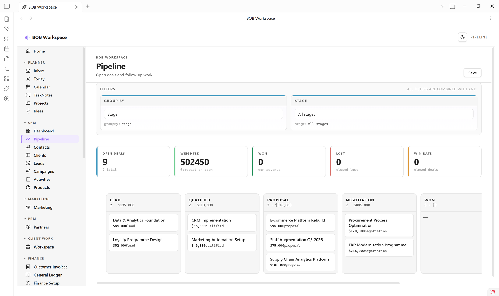
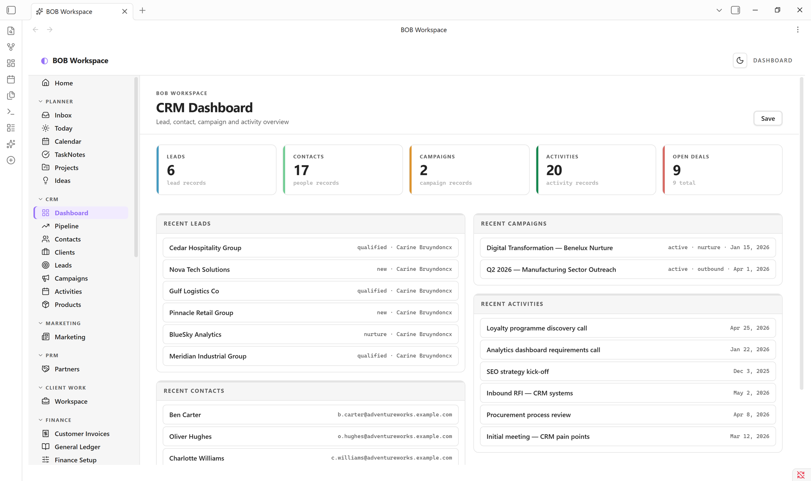
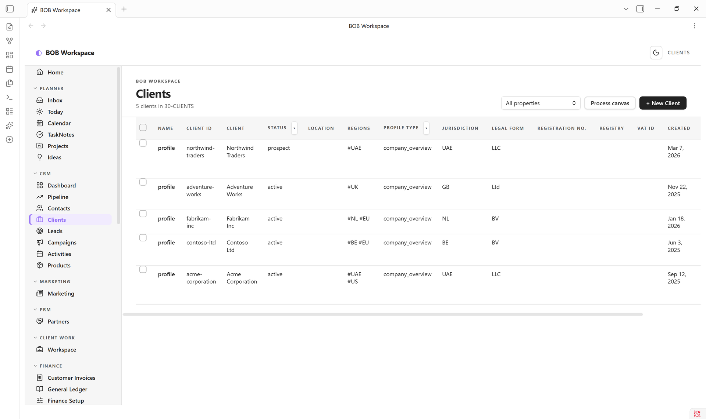
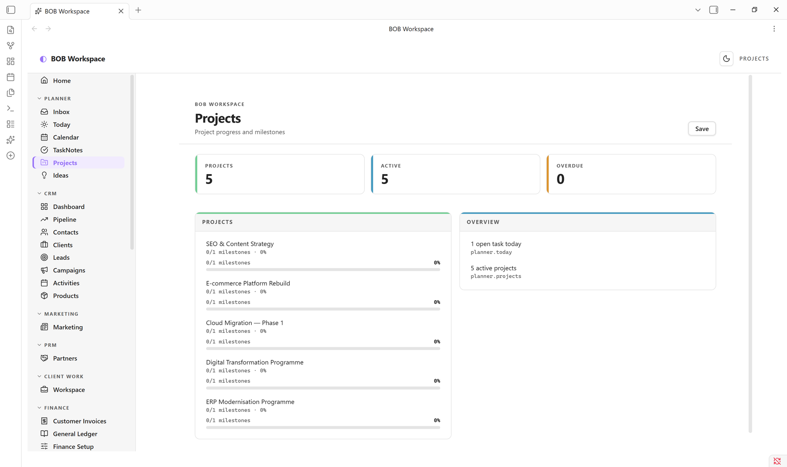
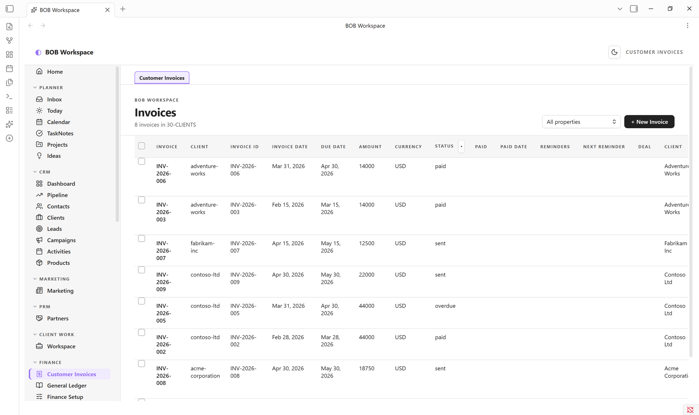
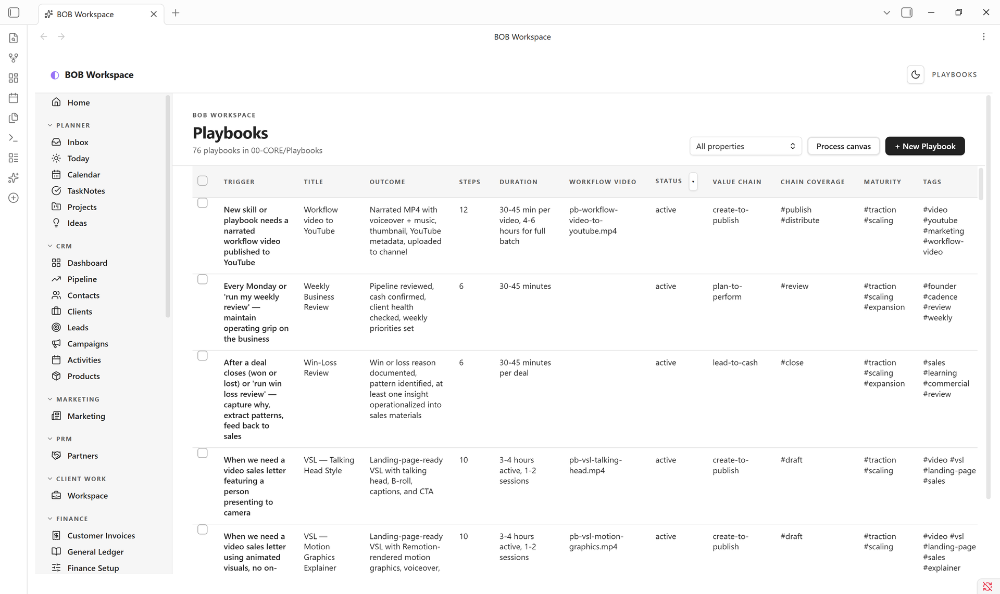

# BOB Workspace — a configurable GUI layer for Obsidian

A **fully configurable GUI application layer** built on top of plain markdown. BOB Workspace turns Obsidian into an interactive, visually rich workspace for **CRM, deal pipelines, project management, client engagements, custom dashboards, and daily planning** — with zero servers, no cloud lock-in, and 100% portable markdown.

Instead of navigating disconnected notes or juggling dozens of fragmented tools, BOB Workspace provides a unified, app-grade graphical user interface that writes directly to standard markdown files in your vault.

Whether starting fresh or organizing an existing vault, BOB Workspace provides starter templates to get you running in minutes. Built-in defaults work out of the box, while the visual **Surface Designer**, schema YAML editor, and Obsidian Bases integration let you reshape every dashboard, list, and navigation element to fit your exact workflow.

Start with the [empty-vault quickstart](docs/empty-vault-quickstart.md) or [existing-vault installation guide](docs/installing-into-existing-vault.md). For extension guidance, see [Extending BOB Workspace Without Code Changes](docs/extending-bob-workspace.md).

💬 **Docs, support, and community:** join the **ThirdBrain BOB** Skool community → https://www.skool.com/thirdbrain-tech-3102


## Screenshots

|  |  |
|---|---|
| **CRM Pipeline** — deal kanban across stages | **CRM Dashboard** — metrics, recent leads & activity |
|  |  |
| **Clients** — entity list with rich frontmatter | **Projects** — milestone progress across active work |
|  |  |
| **Customer Invoices** — finance & accounting surfaces | **AI Playbooks** — reusable, schema-backed workflows |
|  |  |

*(Screenshots use a fictional demo vault — Acme / Contoso / Fabrikam — not real client data.)*

---

## Why BOB Workspace

Most "second brain" plugins do *one* thing well. BOB Workspace is the opposite: a coherent **graphical operating system** that brings together the surfaces a working person actually moves between every day — today's tasks, the week ahead, deals in flight, contacts, projects, recurring reminders — and presents them in a single tab with one familiar nav.

- **A fully configurable GUI layer.** Not a rigid pre-packaged app. Use the built-in **Surface Designer** to compose custom dashboards, metric cards, charts, task lists, and activity heatmaps with live preview.
- **Visual Data Model & Schema Designer.** Define your own record types visually in Settings (fields, data types, enums, required validation, folder locations) without writing code.
- **Obsidian Bases integration.** Bind `.base` files to drive filters, sorting, grouping, and views directly from Obsidian Bases.
- **Markdown is the source of truth.** Every contact, deal, project, activity is a `.md` file with frontmatter. Tasks, Dataview, Templater all keep working. Move to a different vault tomorrow — your data goes with you.
- **One tab, many surfaces.** A left rail lets you flip between Home → Today → Pipeline → Contacts → Projects → Inbox → Reports without ever leaving the workspace tab.
- **Module toggles.** Turn off CRM, PRM or Planner if you only want some of it.
- **Reminders that fire.** A small Inbox + capture modal + ticker = real notifications, not just a tag on a note.

---

## Features

### Home — your command centre
Two-column dashboard: today's tasks (tickable inline) · this week's progress · upcoming deadlines · partners due for follow-up · top active projects with milestone progress · pipeline at a glance · recent activity. Optional "open on Obsidian startup" + Homepage plugin compatible.

### Planner
- **Today** — diary view of today's daily note with quick-add task and autosaving journal
- **Calendar (week)** — Mon–Sun grid across daily notes; tick any task from any day
- **Projects** — status-grouped card grid with milestone progress and next-up dates
- **Inbox** — universal capture + reminders; items grouped by Now / Today / This Week / Later

### CRM
- **Dashboard** — pipeline-by-stage bars, hot deals (top by value), stale deals (no edits in 14+ days), recent activity, customer base mini-stats
- **Pipeline** — kanban board across deal stages; drag-and-drop a card to update its `stage` frontmatter; Won column gets a soft emerald tint
- **Contacts / Companies / Activities** — sortable list views with rich frontmatter editing

### PRM
Partners · Registrations · Commissions · Leads · Certifications · Analytics — same entity-list pattern, in their own folders, with status enums and Reports that aggregate across them.

### Client Work
A delivery overview across everything you do *for* a client after the deal is won: Meetings, Comms, Deliverables, Feedback, Surveys, Testimonials, Decisions — each its own tab, with client/project selectors that filter the whole workspace to one engagement.

### Finance
Customer Invoices, General Ledger, Finance Setup, Assets & Close, and Tax — accounting-period, bank-reconciliation, chart-of-accounts, VAT/corporate-tax and compliance record types, each with its own list and detail view. Built for tracking the finance side of a services business, not double-entry bookkeeping.

### Suppliers & Procurement
Suppliers, Supplier Invoices, Purchase Requisitions, Purchase Orders — the mirror image of the CRM/Finance pipeline for what you buy instead of what you sell.

### Project Management
Click a project, get a **real PM surface** — not a markdown editor. Hero with status/priority pills, owner, due date, color-banded progress bar. Left column: tickable milestones (date + title + delete on hover) and tasks with `+ Add` buttons. Right column: Brief, Scope, Risks, Stakeholders, Notes — all autosaving textareas writing back to their H2 sections. `Open as note` for full body editing in Obsidian's editor.

### Reminders
Quick-capture with `Cmd+Shift+I` → modal with text, optional datetime, optional repeat (daily/weekly). The plugin ticks every 30 seconds and fires due reminders as in-app notices (and optionally desktop notifications). Snooze 15m / 1h / tomorrow on any reminder. The nav badge shows live overdue count.

### Reports
Pipeline · Sales · Partners · Activity · Productivity · KPI Scoreboard. These surfaces are config-driven dashboards with widget catalogs rather than separate hardcoded report screens. Productivity follows the configured task mode: daily note checkboxes, TaskNotes, or hybrid. TaskNotes history includes the active TaskNotes folder plus the configured archive folder.

### Canvas surfaces — context, not just diagrams
BOB treats Obsidian's native **Canvas** as a render target for *operational context*, not a manual drawing tool. From any entity, generate a standard `.canvas` file: an **Entity Context** canvas (the record at centre, surrounded by its evidence, people/systems, outputs and risks, drawn from links + backlinks), an **Agent Audit** canvas for AI-run notes, a **Process runway** for anything with a stage/status lifecycle, or a **Pipeline board**. Regenerating refreshes BOB's own nodes while keeping anything you added by hand. The `.canvas` files are 100% standard JSON Canvas — portable to any tool that reads the format. See [Canvas surfaces](docs/canvas-surfaces.md).

### AI Workspace — Playbooks & Skills
A place to keep your own reusable playbooks and AI agent skills as plain markdown/`SKILL.md` records — trigger, outcome, steps, duration — browsable and filterable like any other entity. BOB ships the record types, not content: a fresh vault starts with empty Playbooks/Skills lists ready for your own library.

### More schema-backed domains
The shipped **BOB Workspace** template also includes **Marketing** (content), **HR & People** (Recruiting, Payroll), **Research & Knowledge** (a research hub), and **Audit** (Operational Audit) — configured entirely through schema YAML and `workspace.json`, not hardcoded plugin code, so they're a starting point you're expected to reshape for your own vault.

### New entity capture
A clean two-column modal for every entity type — type-aware widgets (date pickers, dropdowns for stage/status/priority/tier/type), smart defaults, smart placeholders, primary field marked required. Enter to submit, Esc to cancel.

### CSV import
Bring an entire client list, pipeline, or partner roster in from a spreadsheet. Run **BOB Workspace: Import from CSV** (or hit "Import CSV" on any list view) → pick a `.csv` from your vault or paste raw text → BOB Workspace auto-maps columns to entity fields by name (with synonyms — `Email`, `email`, `Email Address` all map to `email`). Override any mapping, see a sample of the first two rows, then import. Each row becomes one markdown file with frontmatter populated.

### XLSX workbook export / import
Export your entities to a multi-sheet `.xlsx` workbook (one sheet per entity type, grouped by area) with **BOB Workspace: Export to XLSX**, and import edits back in with **Import XLSX**. Arrays and objects use explicitly marked JSON cells to preserve their types on round-trip. Blank cells leave existing values unchanged; nested edits in the app use **Open as note**. The SheetJS library is bundled into the plugin, so export/import works offline with no extra files to install.

### Bases-backed views
Entity lists can be driven by Obsidian **Bases** (`.base`) files for richer filtering, sorting, and column control. The **Bases folder** setting resolves bare filenames; explicit vault paths stay at their configured locations, and **Generate missing bases** creates a starter `.base` (filter + table view) for any entity that doesn't have one — including entities you define purely via schema YAML. See *Configuration* below.

---

## Install

### Community plugin store *(once approved)*
1. Settings → Community plugins → Browse
2. Search "BOB Workspace"
3. Install → Enable

### Manual install (works today)
1. Download `main.js`, `manifest.json`, and `styles.css` from the [latest release](https://github.com/cbruyndoncx/obsidian-bob-workspace/releases/latest) (workspace templates and the XLSX library are bundled inside `main.js`)
2. Drop them into `<your-vault>/.obsidian/plugins/bob-workspace/`
3. Settings → Community plugins → Reload → Enable **BOB Workspace**

### First run in a new vault
When you install the plugin into a fresh vault, BOB Workspace opens with a setup picker if no `workspace.json` exists yet. Choose a starter template, or skip for now and build the workspace yourself.

After you apply a template, the plugin writes the active `workspace.json` into the plugin folder and reloads the workspace. If schema support is enabled and the schema source folder is empty, it also bootstraps canonical schema YAML from the current workspace entity definitions and generates the derived FileClasses and JSON Schema outputs.

The plugin then creates note folders on demand as you use the surfaces. It does not require you to pre-create the full folder tree before testing.

### Starter templates
The shipped templates are:

- **BOB Workspace** — the full business suite: Planner, CRM, PRM, Client Work, Finance, Suppliers & Procurement, Reports, and AI Workspace. Schema-driven.
- **CRM Only** — a focused sales & CRM workspace: Pipeline kanban, Contacts, Clients, Leads, Campaigns, Activities, and Reports.
- **EMAI Starter** — a PARA-style personal workspace: **Human** (tasks, projects, areas, resources, people, daily, reviews), **Content** (videos, briefs, calendar, research), and **Machine** (workflows, SOPs, agents, code, skills).
- **Minimal** — a blank slate with only Home and Settings. Build your own navigation and dashboards from scratch.
- **Cadence Classic** — legacy layout using Cadence/ folder conventions for users migrating from the upstream Cadence plugin.

Use **BOB Workspace** for the full business model, **CRM Only** for a lighter sales-focused start, **EMAI Starter** for a PARA personal-productivity workspace, or **Minimal** to build everything by hand.

**Templates bring their own entities.** A template can embed its entity definitions (schema YAML) and `.base` files. Applying it writes *exactly* those into the configured schema/Bases folders, so a template like EMAI Starter provisions only its own entities on a fresh vault — it never falls back to the full built-in business model. BOB Workspace also ships its full schema and Base assets; it does not rely on the lean built-in entity defaults for a fresh installation.

**Switching templates archives the previous configuration.** Applying a different template moves schema sources, derived outputs, and Bases from the configured folders into sibling archive folders. Before moving files, it saves the outgoing workspace, settings, and full move plan in `template-switch-<template>-<timestamp>.json` in the installed plugin folder. Archive failures stop the switch and trigger rollback of completed moves. Explicit Bases elsewhere stay in place and are snapshotted in the recovery file. Re-applying the same template rewrites workspace configuration and fills missing assets; it does not restore edited assets. See [template recovery](docs/installing-into-existing-vault.md#recovering-a-failed-template-switch).

---

## Quick start

1. **Open the app** — Click the ✨ sparkles icon in the left ribbon, or run **Open BOB Workspace** from the command palette
2. **Capture a deal** — CRM → Pipeline → `+ New Deal` → fill in title, stage, value → Create
3. **Capture a contact** — CRM → Contacts → `+ New Contact`
4. **Plan a project** — Planner → Projects → `+ New Project` → click into it → tick milestones, fill in Brief
5. **Set a reminder** — `Cmd+Shift+I` → "Call John" → Remind me → +1h → Capture. Wait. The notification fires.
6. **Make BOB Workspace your homepage** — Settings → BOB Workspace → toggle "Open BOB Workspace on Obsidian startup"
7. **Seed schemas if needed** — when schema support is enabled, the plugin can generate missing canonical schema YAML in the configured source folder and then write the derived FileClasses and JSON Schema outputs.

BOB Workspace creates folders on demand. The shipped defaults follow a numbered vault layout — contacts in `10-ME/10-PEOPLE/`, clients and deals in `30-CLIENTS/`, partners in `20-COMPANY/35-PARTNERS/`, etc. Move them anywhere afterwards — change paths in Settings if you do.

---

## Configuration

Settings → BOB Workspace provides tabbed configuration for every layer of your workspace:

1. **Workspace** — apply starter templates, check active template status, view/edit the raw `workspace.json`, and manage recovery snapshots.
2. **Review** — live audit panel showing registered surfaces, entity folders, active modules, and configuration health.
3. **Navigation** — organize the left-rail navigation: reorder groups, change labels, choose icons, and manage secondary tabs.
4. **Dashboards** — configure surfaces, widgets, and layout blueprints with deep links to the Surface Designer.
5. **Widgets** — widget catalog, data sources, and field bindings for dashboard and report cards.
6. **Modules** — enable or disable core modules (Planner, CRM, PRM, Client Work, Finance, Procurement) and configure entity folders.
7. **Data model** — canonical schema designer, FileClass and JSON Schema generation, Bases folder setting, and the **Generate missing bases** action.
8. **Planner** — configure daily note folder location, section headings (Tasks, Journal), checkbox formats, and TaskNotes behavior.
9. **App** — startup behavior ("Open BOB Workspace on startup"), default surface, week start day, built-in theme override, reminder notifications, and currency symbol.
10. **Exports** — define multi-sheet XLSX export groups.
11. **Data** — import/export operations, CSV column mapping, and data integrity tools.

When you are customizing a vault, use this order:

1. Pick a starter template or apply your own `workspace.json`.
2. Define or bootstrap the schema layer.
3. Associate `.base` files for entities that need view behavior.
4. Adjust navigation groups and secondary tabs.
5. Tune dashboards and report widgets.
6. Set modules, folders, and app defaults.
7. Test the resulting workspace in the vault before copying it elsewhere.

---

## Commands & Hotkeys

| Command Palette Action | Default Shortcut | Description |
| --- | --- | --- |
| **Quick capture (with optional reminder)** | `Cmd+Shift+I` (`Ctrl+Shift+I`) | Quick note capture with optional date, time, and recurrence |
| **Open BOB Workspace** | *(assignable)* | Opens the full BOB Workspace application tab |
| **Open BOB Workspace — Home** | *(assignable)* | Jump straight to the Home command centre |
| **Open BOB Workspace — Today** | *(assignable)* | Jump straight to Today's planner and journal |
| **Open BOB Workspace — Calendar** | *(assignable)* | Open the weekly calendar view |
| **Open BOB Workspace — Pipeline** | *(assignable)* | Open the visual deal kanban board |
| **Open BOB Workspace — Inbox** | *(assignable)* | View all captures, reminders, and project tasks |
| **Open BOB Workspace — Canvases** | *(assignable)* | Open the canvas manager |
| **Open BOB Workspace — Surface Designer** | *(assignable)* | Open the live dashboard & widget layout designer |
| **BOB: Context canvas for active note** | *(assignable)* | Generate a visual context canvas around the current note |
| **Import from CSV** | *(assignable)* | Import contacts, deals, or records from a spreadsheet |
| **Export all entities to XLSX** | *(assignable)* | Export entities to a multi-sheet Excel workbook |
| **Import entities from XLSX workbook** | *(assignable)* | Import edited entities back from an Excel workbook |
| **Apply workspace template…** | *(assignable)* | Open the template picker to apply or switch templates |
| **Reload workspace.json** | *(assignable)* | Reload the active workspace configuration from disk |
| **New today entry (creates if missing)** | *(assignable)* | Open or create today's daily note |

Assign any command to a hotkey under **Settings → Hotkeys → search "BOB Workspace"**.

---

## How the data is stored

```
your-vault/
  daily/                          ← daily notes (your existing setup)
    2026-05-05.md
  10-ME/10-PEOPLE/Jane Smith.md
  20-COMPANY/00-PROFILE/Acme.md
  20-COMPANY/35-PARTNERS/Distribution Co.md
  30-CLIENTS/Acme — FTTH expansion.md
  30-CLIENTS/Discovery call with Jane.md
  30-CLIENTS/Q3 launch.md
  ...
```

Each entity is plain markdown with YAML frontmatter — readable, editable, scriptable, portable. BOB Workspace's views are just rich lenses over these files; everything you do in the UI writes back to them.

With schema support enabled, the plugin also writes canonical schema YAML to the configured schema source folder and derives `fileClasses/` plus `json-schema/` outputs from that source.

---

## Themes and Appearance

BOB Workspace is designed to look great with **any** Obsidian theme (including the default theme) and adapts automatically to Obsidian's dark and light modes. It also includes its own dark mode toggle in the workspace top bar if you want BOB Workspace in dark mode independently of your Obsidian theme.

*(Optional)* If you want a warm paper aesthetic with emerald accents and Geist + JetBrains Mono typography, the upstream **Cadence** community theme pairs nicely with BOB Workspace.

---

## Roadmap

- Drag-to-reorder milestones in Project Detail
- Linked entities (project ↔ deal ↔ contact pickers with fuzzy search)
- Time-blocked Calendar (drag tasks onto today's hour grid)
- Pomodoro / focus timer linked to a reminder

---

## Maintaining your vault with an AI agent

If you use Claude Code (or another agent that reads the `SKILL.md` format), two
companion skills in [`skills/`](skills/) automate the two extension halves
described above:

- **[`bob-workspace-bootstrap`](skills/bob-workspace-bootstrap/SKILL.md)** — census a vault's templates/frontmatter and write canonical schema YAML (the datamodel half).
- **[`bob-workspace-compose`](skills/bob-workspace-compose/SKILL.md)** — author `workspace.json` (dashboards, widgets, navigation, Base wiring — the UI half).

They're companion agent skills, not code loaded by the Obsidian plugin. Copy
both folders into your agent's skills directory, then point the agent at the
Obsidian vault you want to maintain. They work together without installing the
brncx-skills vault or its context-pack skill. The bootstrap scripts require
Python 3.11+ and `uv` (which installs their declared PyYAML dependency).

The skills read the active schema folder from that vault's installed
`.obsidian/plugins/bob-workspace/workspace.json`; their reports go to
`BOB Workspace/Reports/`. A schema's `location_pattern` must contain a real
vault-relative folder path. The plugin does not expand agent context keys in
schema YAML.

## Development

```bash
git clone https://github.com/cbruyndoncx/obsidian-bob-workspace
cd obsidian-bob-workspace
npm install
npm run check   # typecheck, build main.js, syntax check, and regression tests
# Drop main.js + manifest.json + styles.css
# into <vault>/.obsidian/plugins/bob-workspace/ to test.
```

PRs welcome. For bug reports, please include your Obsidian version, OS, and a minimal vault to reproduce.

---

## Community & support

For documentation, questions, and support, join the **ThirdBrain BOB** community on Skool:

👉 **https://www.skool.com/thirdbrain-tech-3102**

That's the best place for setup help, template/workspace guidance, and to share how you use BOB Workspace.

### Support the original author

BOB Workspace is a fork of the Cadence plugin. If it saves you time, a coffee for the original author keeps the dev nights going. ☕

<a href="https://www.buymeacoffee.com/wesswart77" target="_blank"></a>

---

## License

[MIT](LICENSE) © Wesley Swart (original Cadence plugin) · © Carine Bruyndoncx (BOB Workspace fork)
